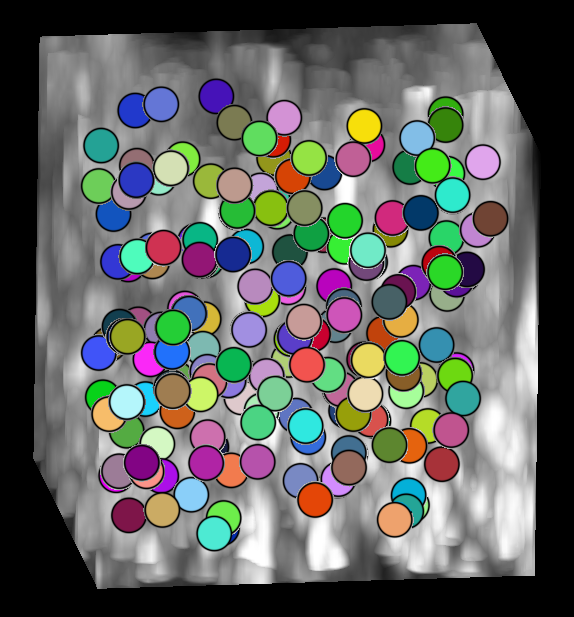
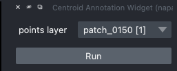
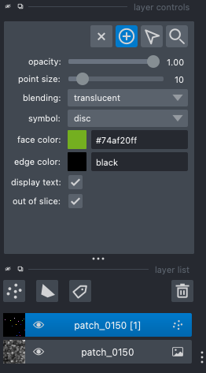
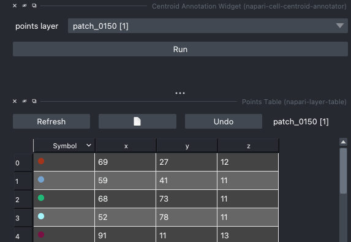

# napari-cell-centroid-annotator

[](https://github.com/tim-vdl/napari-cell-centroid-annotator/raw/main/LICENSE)
[](https://pypi.org/project/napari-cell-centroid-annotator)
[](https://python.org)
[](https://github.com/tim-vdl/napari-cell-centroid-annotator/actions)
[](https://codecov.io/gh/tim-vdl/napari-cell-centroid-annotator)
[](https://napari-hub.org/plugins/napari-cell-centroid-annotator)

A simple plugin to annotate cell centroids in 2D or 3D images

----------------------------------

This [napari] plugin was generated with [Cookiecutter] using [@napari]'s [cookiecutter-napari-plugin] template.

<!--
Don't miss the full getting started guide to set up your new package:
https://github.com/napari/cookiecutter-napari-plugin#getting-started

and review the napari docs for plugin developers:
https://napari.org/stable/plugins/index.html
-->
## Short discription
Easily annotate cell centroids in 2D/3D images. While annotating, every annotated point gets a random color to increase your focus and overview while annotating. Annotated points get a radius to make it easier to see which cells were already annotated when you are in a neighboring slice of its centroid.




## Installation

You can install `napari-cell-centroid-annotator` via [pip]:

    pip install napari-cell-centroid-annotator


To install latest development version :

    pip install git+https://github.com/tim-vdl/napari-cell-centroid-annotator.git

While strictly not required, it is recommended to install this plug-in into a virtual environment, like this:

```sh
conda create -y -n napari-env -c conda-forge python=3.9
conda activate napari-env
pip install napari-cell-centroid-annotator
```

## Usage

Get started by importing a 2D/3D image, either by drag-and-drop into the viewer, or via the menu on top. Next, create a new or import an existing points layer.

Then, start the Centroid Annotation Widget from the Plug-in menu.


Afterwards, select the points layer in the widget that opened on the right and click "Run" to confirm to use this layer for centroid annotation.



Finally, you can start annotating by adding new points, or by editing the existing points.



To get an overview of all annotated points, be sure to have the points layer selected in the layer list and open the [Points Table plug-in](https://www.napari-hub.org/plugins/napari-layer-table) from the Plug-in menu. This plug-in opens a table with the face color and coordinates of every point. From the table, you can now select points in the viewer, and vice-versa. This can come in handy when you want to edit/remove some points.



## Contributing

Contributions are very welcome. Tests can be run with [tox], please ensure
the coverage at least stays the same before you submit a pull request.

## License

Distributed under the terms of the [MIT] license,
"napari-cell-centroid-annotator" is free and open source software

## Issues

If you encounter any problems, please [file an issue] along with a detailed description.

[napari]: https://github.com/napari/napari
[Cookiecutter]: https://github.com/audreyr/cookiecutter
[@napari]: https://github.com/napari
[MIT]: http://opensource.org/licenses/MIT
[BSD-3]: http://opensource.org/licenses/BSD-3-Clause
[GNU GPL v3.0]: http://www.gnu.org/licenses/gpl-3.0.txt
[GNU LGPL v3.0]: http://www.gnu.org/licenses/lgpl-3.0.txt
[Apache Software License 2.0]: http://www.apache.org/licenses/LICENSE-2.0
[Mozilla Public License 2.0]: https://www.mozilla.org/media/MPL/2.0/index.txt
[cookiecutter-napari-plugin]: https://github.com/napari/cookiecutter-napari-plugin

[file an issue]: https://github.com/tim-vdl/napari-cell-centroid-annotator/issues

[napari]: https://github.com/napari/napari
[tox]: https://tox.readthedocs.io/en/latest/
[pip]: https://pypi.org/project/pip/
[PyPI]: https://pypi.org/
